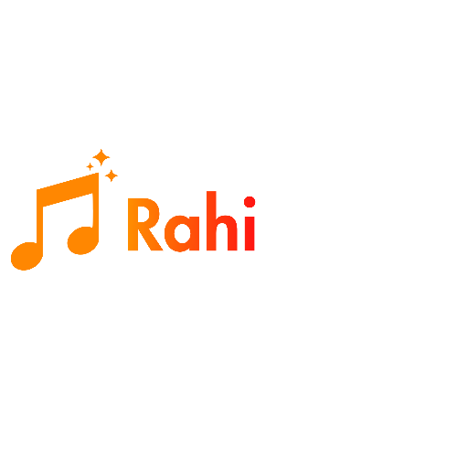

<div align="center">
    
    <h1>🎵 RahiTunes</h1>
    <p><b>A free, open-source Android music streaming app — no ads, no subscriptions, just music.</b></p>

[](https://github.com/rahibladex)
[](LICENSE)
[](https://developer.android.com)
[](https://kotlinlang.org)

</div>

---

## ✨ About

**RahiTunes** is a beautifully designed, privacy-first music streaming application for Android. Built with Jetpack Compose and Material 3, it delivers a premium listening experience with access to over **100 million songs** — completely free and open source.

Stream music, discover new artists, create playlists, and enjoy hi-fi audio quality — all without a single ad or paywall.
---

## 🚀 Features

### 🎶 Music & Playback
- Stream over **100M+ songs** from YouTube Music
- **FLAC 24-bit** hi-fi audio quality support
- Background playback with system media controls
- Queue management with shuffle & repeat modes
- Gapless playback for seamless listening
- Animated play/pause controls with Lottie animations

### 📻 Discovery & Radio
- **Global Top Stations** with live radar updates
- **Personalized recommendations** powered by smart radar
- Quick picks based on your listening history
- Artist & album radio stations
- Mood & genre-based playlists

### 📝 Playlists & Library
- Create, edit, and manage unlimited playlists
- Import playlists from YouTube Music
- Offline caching for listening without internet
- Song bookmarking & favorites
- Search through 100M+ songs instantly

### 🎨 Customization
- **Dynamic themes** with Material You support
- Dark, light, and AMOLED black modes
- Customizable player UI with multiple layouts
- Adjustable thumbnail corner radius
- Swipe-to-action gestures

### 🔧 Advanced
- **Picture-in-Picture (PiP)** mode
- Android Auto support
- Sleep timer with customizable fade-out
- Audio normalization
- Persistent queue across app restarts
- Skip silence in tracks
- Lyrics support (synced & unsynced)

### 🔒 Privacy & Freedom
- **100% Free** — No ads, no subscriptions, no paywalls
- **Open Source** — Full source code available
- **No account required** — Start listening instantly
- **No tracking** — Your data stays on your device

---

## 🛠️ Tech Stack

| Technology | Purpose |
|---|---|
| **Kotlin** | Primary language |
| **Jetpack Compose** | Modern declarative UI |
| **Material 3** | Design system |
| **Room** | Local database |
| **Ktor** | Networking |
| **Coil** | Image loading |
| **Lottie** | Animations |
| **Media3 / ExoPlayer** | Audio playback |
| **Innertube API** | Music streaming backend |

---

## 📦 Building from Source

### Prerequisites
- **Android Studio** Ladybug or newer
- **JDK 17**
- **Android SDK** with API level 34+

### Steps

```bash
# 1. Clone the repository
git clone https://github.com/rahibladex/RahiTunes.git
cd RahiTunes

# 2. Build the debug APK
./gradlew assembleDebug

# 3. Install on a connected device/emulator
./gradlew installDebug
```

The built APK will be available at:
```
app/build/outputs/apk/debug/app-debug.apk
```

---

## 📁 Project Structure

```
RahiTunes/
├── app/                    # Main application module
│   └── src/main/
│       ├── kotlin/         # Kotlin source code
│       │   └── app/rahitunes/android/
│       │       ├── ui/     # Compose UI screens & components
│       │       ├── service/# Playback service
│       │       └── utils/  # Utility classes
│       └── res/            # Resources (icons, strings, themes)
├── core/
│   ├── data/               # Data layer & Room database
│   ├── ui/                 # Shared UI components & theming
│   └── innertube/          # YouTube Music API client
├── providers/              # Content providers
└── gradle/                 # Gradle configuration
```

---

## 🤝 Contributing

Contributions are welcome! Feel free to:

1. **Fork** the repository
2. **Create** a feature branch (`git checkout -b feature/amazing-feature`)
3. **Commit** your changes (`git commit -m 'Add amazing feature'`)
4. **Push** to the branch (`git push origin feature/amazing-feature`)
5. **Open** a Pull Request

---

## 👨‍💻 Developer

<div align="center">

Made with ❤️ by **RahiBladeX**

| | |
|---|---|
| **Developer** | RahiBladeX |
| **GitHub** | [@rahibladex](https://github.com/rahibladex) |
| **Repository** | [rahibladex/RahiTunes](https://github.com/rahibladex/RahiTunes) |
| **Latest Release** | [RahiTunes v1.0](https://github.com/rahibladex/RahiTunes/releases/tag/v1.0) |

</div>

---

## ⭐ Support

If you enjoy using RahiTunes, consider:
- ⭐ **Starring** this repository
- 🐛 **Reporting bugs** via [Issues](https://github.com/rahibladex/RahiTunes/issues)
- 📣 **Sharing** the app with friends
- 🤝 **Contributing** code or translations

---

## 📄 License

```
RahiTunes - Free & Open Source Music Streaming for Android
Copyright (C) 2024-2026 rahibladex

This program is free software: you can redistribute it and/or modify
it under the terms of the GNU General Public License as published by
the Free Software Foundation, either version 3 of the License, or
(at your option) any later version.

This program is distributed in the hope that it will be useful,
but WITHOUT ANY WARRANTY; without even the implied warranty of
MERCHANTABILITY or FITNESS FOR A PARTICULAR PURPOSE. See the
GNU General Public License for more details.
```

---

<div align="center">
    <p>Made with ❤️ by <a href="https://github.com/rahibladex">rahibladex</a></p>
</div>
<!-- update 0 -->
